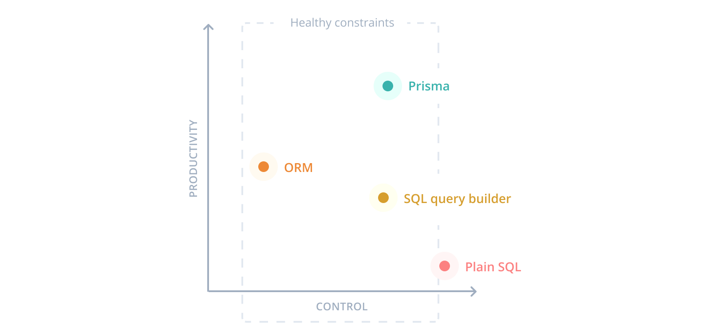

---

# Prisma

-   **Thinking in objects** instead of mapping relational data
-   **Queries not classes** to avoid complex model objects
-   **Single source of truth** for database and application models
-   **Healthy constraints** that prevent common pitfalls and antipatterns
-   **An abstraction that make the right thing easy** ("pit of success")
-   **Type-safe database queries** that can be validated at compile time
-   **Less boilerplate** so developers can focus on the important parts of their app
-   **Auto-completion in code editors** instead of needing to look up documentation

???

---

# What is Prisma?

Prisma is an open source database toolkit. It mainly consists of the following parts

-   **Prisma Client** - Auto-generated and type-safe query builder for Node.js & TypeScript
-   **Prisma Migrate** (experimental) - Declarative data modeling & migration system
-   **Prisma Studio** (experimental) - GUI to view and edit data in your database

???

Какой подход предлагает призма.
Призма, призма фреймворк, это семейство инстурументов для работы с базой данных, которое включает:
Prisma Client - клиент для подключения к БД, Prisma Migrate - инструмент для миграции данных,
Prisma Studio - приложение для манипулирования данными напрямую в БД, что-то вроде
SQL Management Studio.

Сами авторы не относят свой инструмент, ни к ORM, ни к query-builder-у.
