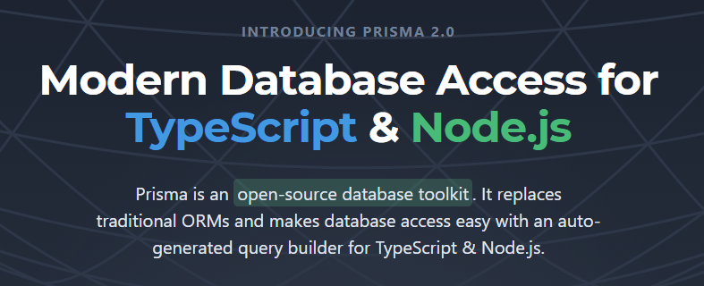
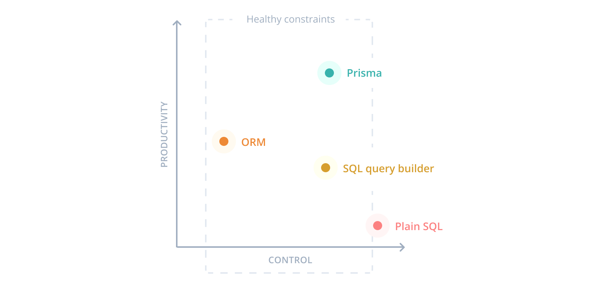
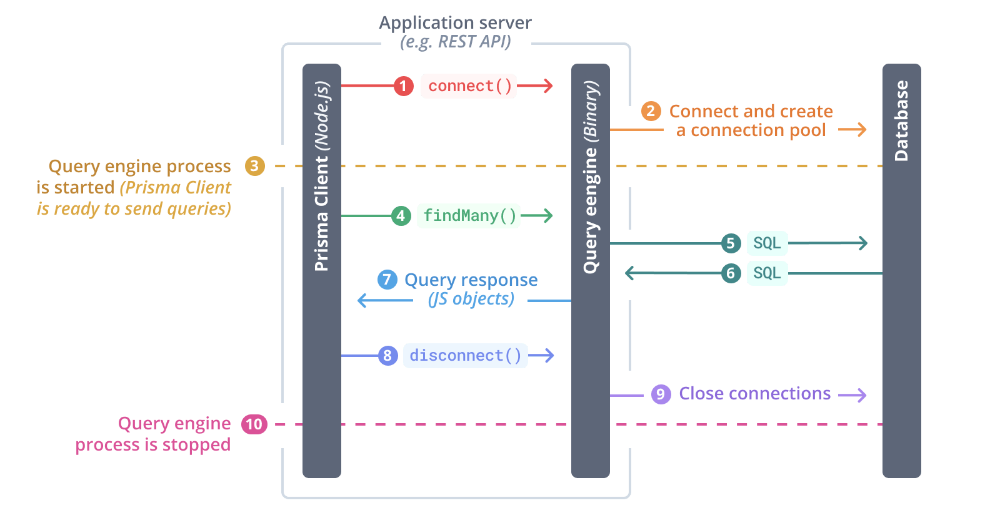

<!-- class: center, middle, no-inverse -->

# Prisma Framework Overview

<!--  -->

<!--  -->

.footnote[2020]

---

class: no-inverse

# Contents

<!-- TODO -->

???
Сегодня мы в основном поговорим о фреймворке prisma, и как с помощью него работать с базой данных.
Сегодня будет обзор фрейморка prisma версии 2.
Если вы что-то слышали о версии 1, то можете забыть о ней,
как будто она никогда не существовала.

<!-- ---

# Comparison of tools

-   Native Driver
-   Query Builder
-   ORM

???

Сначала, давайте посмотрим, какие существуют способы работы с БД. -->

---

# Native Driver

Examples are `pg` or `mysql` modules

```javascript
const { Client } = require('pg');
const client = new Client();
await client.connect();
const result = await client.query('SELECT $1::text as message', ['Hello']);
```

.grid.p-mt-0[
.grid-column-1[

**Benefits**

-   Full Control (Flexibility, Performance, etc.)

]

.grid-column-2[

**Drawbacks**

-   Database Oriented Programming
-   None Level of Abstraction
-   Low Productivity
-   Type Unsafety

]
]

???

Нативный драйвер, как правило, имеет низкоуровневый API:
подключение, авторизация, запросы и т.д.

_Недостатки_ такого способа.
Вместо JS, мы теперь пишем на каком-то другом языке, как правило это SQL
или его диалект. Понятно, что абстрации тут никакой нет. Разработчику нужно делать много ручной работы: перечислить все имена колонок таблиц, в перечислении можно ошибиться, и ошибка обнаружится только в рантайме, нужно знать структуру БД, чтобы соединить таблицы.

Но _Преимущество_ это полный контроль.

---

# Query Builder

Adds a layer of abstraction above raw database-native querying (e.g.&nbsp;`knex.js`)

```js
knex('users')
    .join('contacts', 'users.id', '=', 'contacts.user_id')
    .select('users.id', 'contacts.phone');
```

.grid.p-mt-0[
.grid-column-1[

**Features**

-   May Support Multiple Databases
-   Decompose Queries into Logical Chunks
-   Mixed Database / Programming Focused
-   Medium Productivity

]

.grid-column-2[

**Drawbacks**

-   Still Need to Think About Data in Terms of Sql
-   Low Level of Abstraction
-   Type Unsafety

]
]

???

QB добавляет уровень уровень абстракции к БД, и формально мы уже пишем на javascript-е.
Т.е. вместо спецификаторов в SQL строке, мы используем методы select, join и т.д.
Но все равно, мы должны держать в уме структуру БД, имена колонок, первичных ключей, внешних ключей.
(Левая колонка это фичи, не достоинства/преимущества)

---

# ORM

Object relational mapper, define your application models as classes

.grid.p-mt-0[
.grid-column-1[

**Benefits**

-   Programming Oriented
-   High Level of Abstraction
-   High Productivity

]

.grid-column-2[

**Drawbacks**

-   Low Control
-   [Object-Relational Impedance Mismatch](https://en.wikipedia.org/wiki/Object-relational_impedance_mismatch)
-   May Generate Complicated Queries ([N+1 Problem](https://stackoverflow.com/questions/97197/what-is-the-n1-selects-problem-in-orm-object-relational-mapping))
-   Type Unsafety for Partial Database Queries

]
]

???
В ORM мы абстрагируемся и работаем с сущностями, которые являются частью нашего приложения.
Продуктивность выше.
Еще преимущество, то что теперь не надо знать о стуктуре БД,
как правило, в ORM есть инструменты миграции, они все сгенерируют.

Из _недостатки_, у нас нет полного контроля над БД,
реализация скрыта, мы не знаем там происходит внутри,
ORM может сгенерировать сложные (непроизводительные запросы) запросы.
N+1 проблема.
В некоторых случаях некорректная типизация (в случае TypeScript)

---

# Prisma

Next-generation database tooling

-   **Prisma Client** - A type-safe database client for efficient and safe database access
-   **Prisma Migrate** (experimental) - Declarative data modeling & migration system
-   **Prisma Studio** (experimental) - GUI to view and edit data in your database

???

Призма, призма фреймворк, это семейство инстурументов для работы с базой данных, которое включает:
Prisma Client - клиент для подключения к БД, Prisma Migrate - инструмент для миграции данных,
Prisma Studio - приложение для манипулирования данными напрямую в БД, что-то вроде
SQL Management Studio.

---

# Prisma Client



???
Сами авторы не относят свой инструмент, ни к ORM, ни к query-builder-у.
Это нечто близкое query builder-у, но также имеющую фичи ORM - такие как декларативно запрашивать данные.

Чем же призма принципиально отличается от существующих инструментов?

---

# How it works



???
Ваш код (из node.js) больше не работает с БД напрямую,
а через Query Engine,
Query Engine - исполняемый файл который написан на языке Rust.
nodejs (prisma client) отправляет запрос какие данные мы хотим получить в rust binary (query engine),
rust binary (query engine) конвертирует его в SQL запрос и выполняет к базе данных.

---

# Data Model

-   Manually writing the data model and mapping it to the database with Prisma Migrate
-   Generating the data model from introspecting a database

```
model Post {
  id        Int      @id @default(autoincrement())
  title     String
  content   String?
  published Boolean  @default(false)
  author    User?    @relation(fields: [authorId], references: [id])
  authorId  Int?
}

model User {
  id        Int      @id @default(autoincrement())
  email     String   @unique
  name      String?
  posts     Post[]
}
```

???
Вместо моделей базы данных, как классов или объектов.
Есть 2 опции:

1. описать модели в схема файле с синтаксисом похожим на graphql
2. интроспектировать существующую бд и получить этот файл (интроспектировать - получить тип и структуру объекта)

-   https://www.prisma.io/docs/understand-prisma/data-modeling

---

<!--
generate types and cleint based on this model
--->
